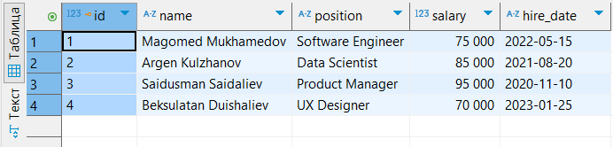
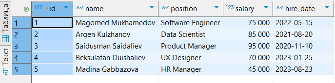
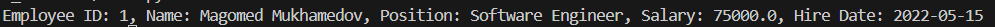
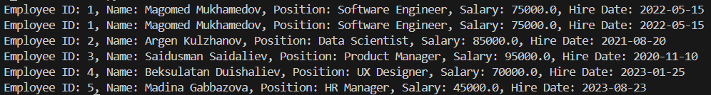
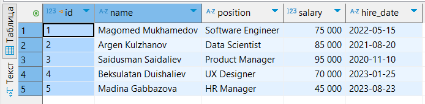
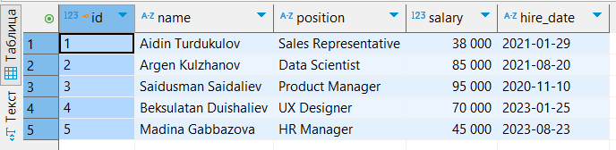
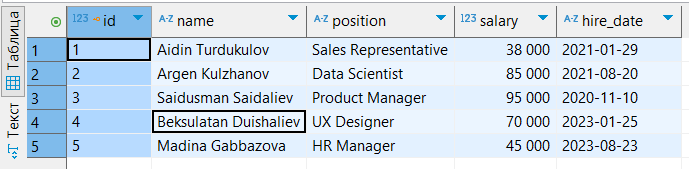
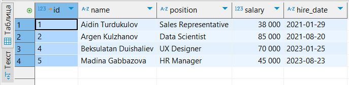

# Employee Database

This repository is a Python-based project that demonstrates Object-Oriented Programming (OOP) concepts by implementing an employee database system. The project is structured to manage employee records, including adding, updating, and retrieving employee details.

## Structure

- [employee.py](employee.py) - the file that that is used to create `Employee` instances.
- [database.sqlite](database.sqlite) - the database that contains information about employees.
- [dao.py](dao.py) - the file that deals with database and makes CRUD operations.
- [main.py](main.py) - the file that is used for testing.
- [imgs](imgs) - the directory that contains screenshots of tests.

## `Employee` class
The class that is used to create employee objects. It has getters and setters for each attribute used.

### Attributes
- `id`: Employee identificator.
- `name`: Employee's name.
- `position`: The position that employee has.
- `salary`: Salary of the employee.
- `hire_date`: The data when the employee was hired.

## `EmployeeDAO` class
Class that is responisble with operation with the database.

### Attributes
- `database`: Path to database.

### Methods
- `insert(employee: Employee)`: Adds a new employee into database.
- `get_by_id(id: int)`: Returns all data about employee with id given.
- `get_all()`: Returns all employees' data.
- `update(employee: Employee)`: Rewrites the employee data.
- `delete(id: int)`: Deletes employee by id.

## Test input/output
### 1. Inserting a new employee
#### Initially the database looks like this:


```python
    new_emp = Employee(120321, "Madina Gabbazova", "HR Manager", 45000, "2023-08-23")
    dao.insert(new_emp)
```


### Retrieving the employee by ID
```python
    emp = dao.get_by_id(1)
    print(emp)
```


### Retrieving all employees
```python
    emps = dao.get_all()
    for emp in emps:
        print(emp)
```


### Updating employee


```python
    emp_update = Employee(1, "Aidin Turdukulov", "Sales Representative", 38000, "2021-01-29")
    dao.update(emp_update)
```



### Deleting employee


```python
    dao.delete(3)
```



## Installation and Usage
1. Clone the repository:
    ```bash
    git clone https://github.com/kd0nwww/employee_database.git
    ```
2. Navigate to the project directory:
    ```bash
    cd employee_database
    ```
3. Run the script:
    ```bash
    python main.py
    ```